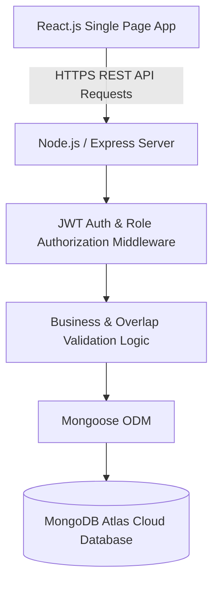

# Schedulo

## Smart Appointment Management Platform

A modern, full-stack **MERN (MongoDB, Express.js, React.js, Node.js)** enterprise scheduling platform designed to streamline appointment booking, staff availability management, double-booking prevention, and executive analytics.

---

## 📋 Table of Contents
- [Project Overview](#project-overview)
- [Problem Statement](#problem-statement)
- [Objective](#objective)
- [Key Features](#key-features)
- [User Roles & Permissions](#user-roles--permissions)
- [End-to-End Workflow](#end-to-end-workflow)
- [Technology Stack](#technology-stack)
- [System Architecture](#system-architecture)
- [Database Design](#database-design)
- [API Documentation](#api-documentation)
- [Business Validation Rules](#business-validation-rules)
- [Project Directory Structure](#project-directory-structure)
- [Installation & Local Setup](#installation--local-setup)
- [Environment Variables](#environment-variables)
- [MongoDB Atlas Setup](#mongodb-atlas-setup)
- [Seed Data & Demo Access](#seed-data--demo-access)
- [Deployment Guide](#deployment-guide)
- [Testing & Quality Assurance](#testing--quality-assurance)
- [Assumptions & Known Limitations](#assumptions--known-limitations)
- [Future Enhancements](#future-enhancements)
- [Security Implementation](#security-implementation)

---

## 🚀 Project Overview
**Schedulo** provides a centralized appointment workflow for clients, specialists, and administrators. It automates client self-service booking, calculates real-time time slot availability based on specialist shifts and existing bookings, enforces backend double-booking overlap prevention, and provides real-time analytics aggregation pipelines via MongoDB.

---

## 💥 Problem Statement
Traditional appointment scheduling systems suffer from:
1. **Fragmented Workflows**: Manual phone calls, emails, or spreadsheets lead to scheduling errors and missed appointments.
2. **Double Booking**: Concurrent booking attempts often result in overlapping appointments for staff members.
3. **Lack of Visibility**: Clients lack real-time visibility into appointment status (`PENDING`, `CONFIRMED`, `REJECTED`, `RESCHEDULED`, `COMPLETED`), while administrators lack aggregated performance metrics.

---

## 🎯 Objective
To engineer a real, cloud-connected MERN stack application that automates the appointment lifecycle with:
- Persistent cloud database storage via **MongoDB Atlas**.
- Secure authentication using **JWT** and **Bcrypt password hashing**.
- Dynamic time slot calculation and server-side overlap validation.
- Role-customized interactive dashboards for Clients, Staff, and Administrators.

---

## ✨ Key Features
- **User Authentication**: Secure Registration, Login, JWT Bearer Token authorization, and Session Management.
- **Quick Demo Access**: One-click demo login flow using real seeded MongoDB accounts.
- **Interactive Multi-Step Booking**: 5-step intuitive booking wizard (Select Service $\rightarrow$ Select Specialist $\rightarrow$ Pick Available Slot $\rightarrow$ Details $\rightarrow$ Review & Submit).
- **Selected Card Visual Feedback**: Glowing ring borders (`ring-2 ring-brand-500`), subtle scale animation, and checkmark badges on selected items.
- **Double-Booking Overlap Prevention**: Mathematical interval validation $(start_1 < end_2) \land (end_1 > start_2)$ enforced at database level.
- **Staff Portal & Action Queue**: Approval, Rejection with reason, and Rescheduling workflow for staff specialists.
- **User Dashboard Filtering**: Interactive KPI stat cards with in-place table filtering by status (`PENDING`, `CONFIRMED`, `COMPLETED`).
- **Executive Analytics**: MongoDB Aggregation pipelines computing gross revenue, monthly appointment distributions, service performance, and staff workloads rendered with **Recharts**.
- **Responsive Dark Theme UI**: Tailored Tailwind CSS dark-mode theme designed for desktop, tablet, and mobile displays.

---

## 👥 User Roles & Permissions

| Role | Permissions & Capabilities |
| :--- | :--- |
| **Client (`user`)** | Browse catalog, check live specialist slot availability, submit booking requests, track status updates, cancel pending/confirmed appointments. |
| **Specialist (`staff`)** | View personal daily schedule, approve pending requests, reject with mandatory rationale, reschedule bookings to new slots, mark visits completed. |
| **Administrator (`admin`)** | Full platform oversight, create/edit/delete services and staff profiles, manage user accounts, access executive analytics & revenue metrics. |

---

## 🔄 End-to-End Workflow

```text
User Selects Service & Specialist
           ↓
Backend Checks Shift Hours & MongoDB Bookings
           ↓
User Picks Open Time Slot & Submits Request
           ↓
Backend Enforces Overlap & Date Validation
           ↓
MongoDB Document Created with 'PENDING' Status
           ↓
Staff Portal Displays Pending Queue
           ↓
Staff Member Approves / Reschedules / Rejects
           ↓
Real-Time Status Update Reflected on Client Dashboard
```

---

## 🛠️ Technology Stack

| Layer | Technology | Description |
| :--- | :--- | :--- |
| **Frontend Framework** | React.js (v18) | Single-page application built with Vite |
| **Styling & Icons** | Tailwind CSS + Lucide Icons | Custom glassmorphism dark mode design system |
| **Data Visualization**| Recharts | Responsive SVG charts for executive analytics |
| **Backend Runtime** | Node.js + Express.js | Modular RESTful API backend architecture |
| **Database** | MongoDB Atlas | Managed cloud NoSQL database cluster |
| **Object Data Modeling**| Mongoose (v8) | Schema validation, hooks, indexes, & aggregation pipelines |
| **Authentication** | JSON Web Tokens (JWT) | Signed bearer tokens for stateless session auth |
| **Password Security** | BcryptJS | Salted password hashing algorithm (10 rounds) |
| **Deployment** | Vercel (Client) + Render (API) | Cloud serverless & web service deployment |

---

## 🏗️ System Architecture



### Cloud Deployment Architecture
- **Frontend App**: Deployed on **Vercel** / **Render Static Site**.
- **Backend REST API**: Deployed as Node Web Service on **Render**.
- **Database**: Cloud Cluster hosted on **MongoDB Atlas**.

---

## 🗄️ Database Design
The platform uses **4 core MongoDB Collections**:
1. `users`: Stores login credentials, roles (`user`, `staff`, `admin`), and profile avatars.
2. `staffs`: Stores specialist profiles, department, specialization, working days, and shift hours.
3. `services`: Stores catalog offerings, descriptions, durations, and pricing.
4. `appointments`: Stores booking records, relational ObjectIds, scheduled times, and lifecycle states.

> 📖 **Full Schema Specification**: Refer to [`docs/database-schema.md`](docs/database-schema.md) for complete field types, indexes, and Mermaid ER diagrams.

---

## 🔌 API Documentation
All backend endpoints strictly follow REST standards under `/api`:
- **Auth**: `POST /api/auth/register`, `POST /api/auth/login`, `GET /api/auth/me`
- **Users**: `GET /api/users`, `GET /api/users/:id`, `PUT /api/users/:id`, `DELETE /api/users/:id`
- **Staff**: `GET /api/staff`, `GET /api/staff/:id/slots`, `POST /api/staff`, `PUT /api/staff/:id`, `DELETE /api/staff/:id`
- **Services**: `GET /api/services`, `POST /api/services`, `PUT /api/services/:id`, `DELETE /api/services/:id`
- **Appointments**: `GET /api/appointments`, `POST /api/appointments`, `PATCH /api/appointments/:id/status`
- **Dashboard**: `GET /api/dashboard/stats`, `GET /api/dashboard/appointments-summary`, `GET /api/dashboard/service-performance`, `GET /api/dashboard/staff-workload`

> 📖 **Full Endpoint Reference**: Refer to [`docs/api-documentation.md`](docs/api-documentation.md) for parameters, payloads, and JSON response examples.

---

## ⚙️ Business Validation Rules
1. **Past Date Prevention**: Bookings for dates prior to today are rejected with `400 Bad Request`.
2. **Working Days Check**: Bookings are restricted to weekdays listed in `staff.workingDays`.
3. **Working Shift Window**: Appointment start/end times must fall within `staff.workingHours` (e.g., `09:00 - 17:00`).
4. **Double-Booking Overlap Check**:
   $$\text{Overlap} = (start_{new} < end_{existing}) \land (end_{new} > start_{existing})$$
   Rejects booking if staff member has an active (`PENDING`, `CONFIRMED`, `RESCHEDULED`) appointment during that time window.
5. **State Transition Rules**: Terminal states (`COMPLETED`, `REJECTED`, `CANCELLED`) cannot be modified.

---

## 📂 Project Directory Structure

```text
Schedulo/
├── client/                     # Frontend React (Vite) application
│   ├── src/
│   │   ├── components/         # Reusable UI components & booking wizard
│   │   ├── context/            # AuthContext & ToastContext state
│   │   ├── layouts/            # Main & Dashboard layout shells
│   │   ├── pages/              # Role dashboard & management pages
│   │   ├── services/           # Axios API client modules
│   │   └── utils/              # Date/time formatters
│   ├── package.json
│   └── vite.config.js
├── server/                     # Backend Node.js / Express server
│   ├── config/                 # MongoDB database connection configuration
│   ├── controllers/            # Request handlers & aggregation logic
│   ├── middleware/             # JWT auth, role authorization, & error handling
│   ├── models/                 # Mongoose schemas (User, Staff, Service, Appointment)
│   ├── routes/                 # Express API routes
│   ├── seed/                   # Database seeder scripts & sample datasets
│   ├── services/               # Appointment validation & slot computation logic
│   ├── server.js               # Application entry point
│   ├── .env.example            # Environment variables template
│   └── package.json
├── docs/                       # Project Documentation Package
│   ├── database-schema.md      # Mongoose schema reference & ER diagram
│   ├── api-documentation.md    # REST API endpoints reference
│   ├── test-cases.md           # Empirical test cases & verification log
│   ├── sample-data.md          # Seed accounts & sample dataset documentation
│   └── screenshots/            # Submission screenshot checklist
├── README.md                   # Primary project documentation
└── package.json                # Root package workspace helper scripts
```

---

## 💻 Installation & Local Setup

### Prerequisites
- **Node.js**: v18.x or higher
- **npm**: v9.x or higher
- **MongoDB Atlas** account (or local MongoDB instance)

### 1. Clone Repository
```bash
git clone https://github.com/adityabhakad/Schedulo.git
cd Schedulo
```

### 2. Install Dependencies
Run automated setup script from root directory:
```bash
npm run setup
```
*(Or install manually inside `server/` and `client/` directories using `npm install`)*

---

## 🔑 Environment Variables

Create a `.env` file inside the `server/` directory:

```env
PORT=5000
MONGODB_URI=mongodb+srv://<username>:<password>@<cluster-address>/scheduloDB?retryWrites=true&w=majority
JWT_SECRET=your_jwt_secret_key_here
JWT_EXPIRES_IN=7d
NODE_ENV=development
```

For client deployment (optional):
```env
VITE_API_URL=http://localhost:5000/api
```

> ⚠️ **CRITICAL SECURITY NOTE**: Never commit `.env` files or database credentials to GitHub. `.env` is listed in `.gitignore`.

---

## ☁️ MongoDB Atlas Setup
1. Log in to [MongoDB Atlas](https://www.mongodb.com/cloud/atlas).
2. Create a new database cluster.
3. Under **Database Access**, create a user with read/write privileges.
4. Under **Network Access**, add IP address `0.0.0.0/0` (allow access from anywhere for cloud deployment).
5. Copy the connection string into `server/.env` as `MONGODB_URI`.

---

## 🚀 Running Locally

Start Backend REST API:
```bash
npm run server
```
*(Backend runs on `http://localhost:5000`)*

Start Frontend App:
```bash
npm run client
```
*(Frontend runs on `http://localhost:3000`)*

---

## 🌱 Seed Data & Demo Access

To populate MongoDB Atlas with initial demo users, specialists, services, and realistic appointments:

```bash
npm run seed
```

### Quick Demo Accounts

| Role | Email | Password |
| :--- | :--- | :--- |
| **Admin** | `admin@schedulo.com` | `password123` |
| **Staff Specialist** | `staff.vance@schedulo.com` | `password123` |
| **Client** | `user.alice@schedulo.com` | `password123` |

> 📖 **Full Sample Data Documentation**: Refer to [`docs/sample-data.md`](docs/sample-data.md).

---

## 🌐 Deployment Guide

### Deploying Backend on Render
1. Create a **New Web Service** on Render connected to `adityabhakad/Schedulo`.
2. Set Root Directory to `server`.
3. Set Build Command to `npm install`.
4. Set Start Command to `npm start`.
5. Environment Variables: Add `MONGODB_URI`, `JWT_SECRET`, and `NODE_ENV=production`.

### Deploying Frontend on Vercel
1. Import repository on Vercel with Root Directory set to `client`.
2. Set Framework Preset to **Vite**.
3. Environment Variables: Add `VITE_API_URL` pointing to your Render backend API URL (e.g. `https://schedulo-api.onrender.com/api`).

---

## 🧪 Testing & Quality Assurance
Run test suite verification:
```bash
node scratch/test_flow.js
```

> 📖 **Full Verification Log**: Refer to [`docs/test-cases.md`](docs/test-cases.md) for detailed test cases and verification results.

---

## 💡 Assumptions & Known Limitations

### Implementation Assumptions
- Staff members work fixed shifts defined in `workingHours` (e.g., `09:00 - 17:00`).
- Time slots are dynamically calculated in 30-minute intervals based on requested service duration.

### Current Limitations
- External calendar synchronization (Google Calendar / Outlook) is not yet enabled.
- SMS / Email push notifications require SendGrid / Twilio API keys.

---

## 🔮 Future Enhancements
- 2-Way Google & Outlook Calendar Synchronization.
- SendGrid Email & Twilio SMS automated appointment reminders.
- Stripe Payment Gateway integration for online deposit payments.
- Real-time WebSockets notification engine.

---

## 🛡️ Security Implementation
- **Password Protection**: Salted hashing with `bcryptjs` (10 rounds).
- **JWT Protection**: Signed stateless JWT bearer tokens for authorized sessions.
- **Role Control**: Express `authorize('admin')` middleware protecting sensitive routes.
- **HTTP Security Headers**: Express `helmet()` integration protecting against XSS and clickjacking.
- **Rate Limiting**: `express-rate-limit` restricting excessive requests (30 auth attempts / 15 mins).
- **Input Sanitization**: ReDoS regex sanitization and parameter validation.
