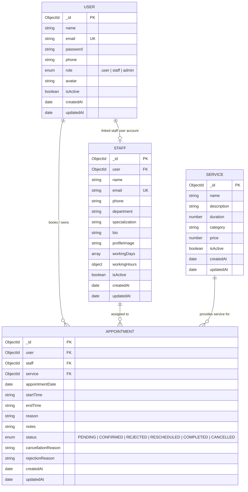

# Schedulo Database Schema Documentation

This document describes the **MongoDB Data Models** implemented using **Mongoose ODM** for the **Schedulo Smart Appointment Management Platform**.

---

## 📐 Data Model Relationship Diagram (Mermaid)

---

## 🗄️ Collections & Schema Details

### 1. `users` Collection (`User` Model)

**Purpose**: Stores user profiles, authentication credentials, avatar links, and role definitions for clients, staff members, and system administrators.

| Field Name | Data Type | Required | Default Value | Validation Rules | Description & References |
| :--- | :--- | :--- | :--- | :--- | :--- |
| `_id` | `ObjectId` | Auto | Generated | Unique Primary Key | Unique document identifier |
| `name` | `String` | **Yes** | — | `maxlength: 100`, trimmed | User's full name |
| `email` | `String` | **Yes** | — | Unique, lowercase, trimmed, Regex Email match | Unique user login email |
| `password` | `String` | **Yes** | — | `minlength: 6`, `select: false` | Hashed password (Bcrypt) |
| `phone` | `String` | No | `""` | Trimmed string | Contact phone number |
| `role` | `String` | No | `'user'` | `enum: ['user', 'staff', 'admin']` | Authorization access level |
| `avatar` | `String` | No | `""` | URL string | Profile image URL |
| `isActive` | `Boolean` | No | `true` | Boolean flag | Account status flag |
| `createdAt` | `Date` | Auto | Timestamp | Mongoose `timestamps: true` | Account creation timestamp |
| `updatedAt` | `Date` | Auto | Timestamp | Mongoose `timestamps: true` | Last profile update timestamp |

**Indexes**:
- `{ email: 1 }` (Unique Index)
- `{ role: 1, isActive: 1 }` (Compound Index for fast role lookup)

---

### 2. `staffs` Collection (`Staff` Model)

**Purpose**: Stores detailed professional profiles, departments, specializations, bio, working days, and working hours for appointment specialists.

| Field Name | Data Type | Required | Default Value | Validation Rules | Description & References |
| :--- | :--- | :--- | :--- | :--- | :--- |
| `_id` | `ObjectId` | Auto | Generated | Unique Primary Key | Unique staff identifier |
| `user` | `ObjectId` | No | `null` | Reference to `User` model | Associated user login ID |
| `name` | `String` | **Yes** | — | Trimmed string | Specialist full name |
| `email` | `String` | **Yes** | — | Unique, lowercase, trimmed | Specialist contact email |
| `phone` | `String` | **Yes** | — | Trimmed string | Specialist contact phone |
| `department` | `String` | **Yes** | — | Trimmed string | Functional department |
| `specialization` | `String` | **Yes** | — | Trimmed string | Specialist clinical/tech domain |
| `bio` | `String` | No | `""` | String | Bio description |
| `profileImage` | `String` | No | `""` | URL string | Specialist avatar image URL |
| `workingDays` | `[String]` | No | `['Monday', ... 'Friday']` | `enum: ['Monday', 'Tuesday', 'Wednesday', 'Thursday', 'Friday', 'Saturday', 'Sunday']` | Scheduled working days |
| `workingHours` | `Object` | No | `{ start: '09:00', end: '17:00' }` | Contains `start` and `end` (HH:mm) | Daily operating shift window |
| `isActive` | `Boolean` | No | `true` | Boolean flag | Active staff availability flag |
| `createdAt` | `Date` | Auto | Timestamp | Mongoose `timestamps: true` | Registration timestamp |
| `updatedAt` | `Date` | Auto | Timestamp | Mongoose `timestamps: true` | Last schedule/profile update |

**Indexes**:
- `{ user: 1 }`
- `{ department: 1, isActive: 1 }`

---

### 3. `services` Collection (`Service` Model)

**Purpose**: Maintains the system service catalog including service title, category, duration in minutes, and price.

| Field Name | Data Type | Required | Default Value | Validation Rules | Description & References |
| :--- | :--- | :--- | :--- | :--- | :--- |
| `_id` | `ObjectId` | Auto | Generated | Unique Primary Key | Unique service identifier |
| `name` | `String` | **Yes** | — | Trimmed string | Service title |
| `description` | `String` | **Yes** | — | String | Detailed description |
| `duration` | `Number` | **Yes** | — | `min: 5` (minutes) | Appointment duration |
| `category` | `String` | **Yes** | — | Trimmed string | Service category grouping |
| `price` | `Number` | No | `0` | `min: 0` | Cost in USD |
| `isActive` | `Boolean` | No | `true` | Boolean flag | Active catalog status |
| `createdAt` | `Date` | Auto | Timestamp | Mongoose `timestamps: true` | Catalog entry timestamp |
| `updatedAt` | `Date` | Auto | Timestamp | Mongoose `timestamps: true` | Last catalog update timestamp |

**Indexes**:
- `{ category: 1, isActive: 1 }`

---

### 4. `appointments` Collection (`Appointment` Model)

**Purpose**: Stores all customer appointment bookings, associated staff member, service, scheduled date/times, status lifecycle state, and reasons for cancellation/rejection.

| Field Name | Data Type | Required | Default Value | Validation Rules | Description & References |
| :--- | :--- | :--- | :--- | :--- | :--- |
| `_id` | `ObjectId` | Auto | Generated | Unique Primary Key | Unique appointment identifier |
| `user` | `ObjectId` | **Yes** | — | Reference to `User` model | Client who booked appointment |
| `staff` | `ObjectId` | **Yes** | — | Reference to `Staff` model | Assigned staff specialist |
| `service` | `ObjectId` | **Yes** | — | Reference to `Service` model | Booked service |
| `appointmentDate` | `Date` | **Yes** | — | Date object | Date of appointment |
| `startTime` | `String` | **Yes** | — | HH:mm string format | Appointment start time |
| `endTime` | `String` | **Yes** | — | HH:mm string format | Calculated end time (`startTime + service.duration`) |
| `reason` | `String` | **Yes** | — | Trimmed string | Client visit reason |
| `notes` | `String` | No | `""` | Trimmed string | Additional client notes |
| `status` | `String` | No | `'PENDING'` | `enum: ['PENDING', 'CONFIRMED', 'REJECTED', 'RESCHEDULED', 'COMPLETED', 'CANCELLED']` | Lifecycle status state |
| `cancellationReason` | `String` | No | `""` | String | Reason provided upon cancellation |
| `rejectionReason` | `String` | No | `""` | String | Reason provided upon staff rejection |
| `createdAt` | `Date` | Auto | Timestamp | Mongoose `timestamps: true` | Booking creation timestamp |
| `updatedAt` | `Date` | Auto | Timestamp | Mongoose `timestamps: true` | Last status update timestamp |

**Indexes**:
- `{ staff: 1, appointmentDate: 1, status: 1 }` (Double-booking overlap lookups)
- `{ user: 1, appointmentDate: 1, status: 1 }` (Client schedule queries)
- `{ status: 1, appointmentDate: -1 }` (Dashboard status aggregations)
- `{ service: 1 }`
