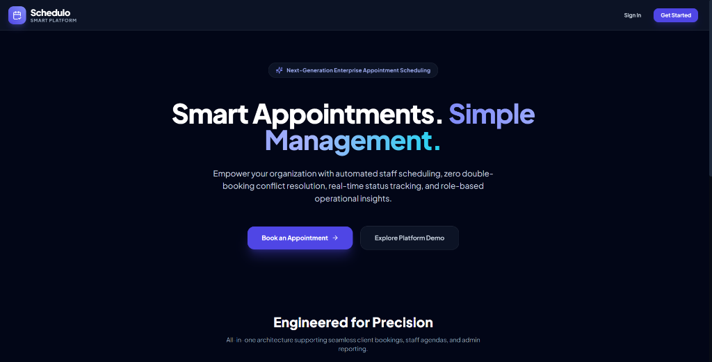
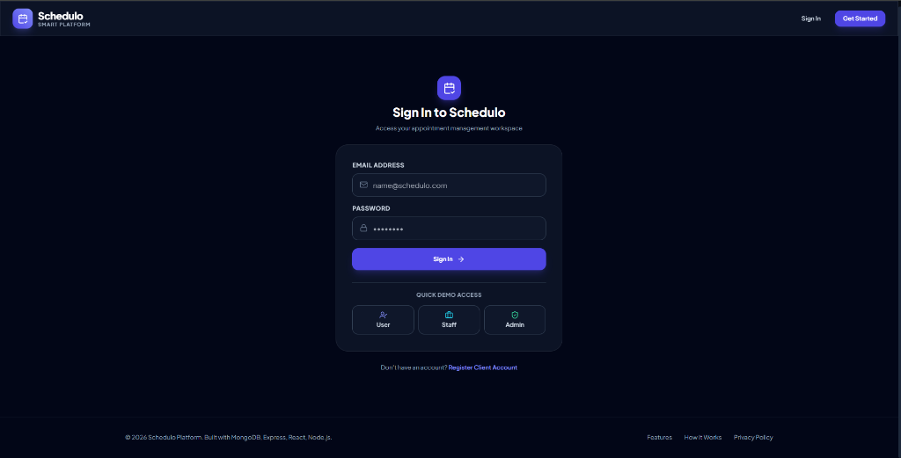
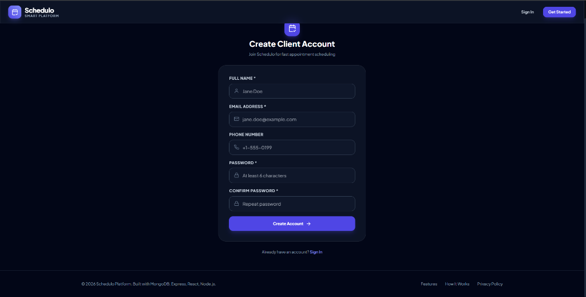
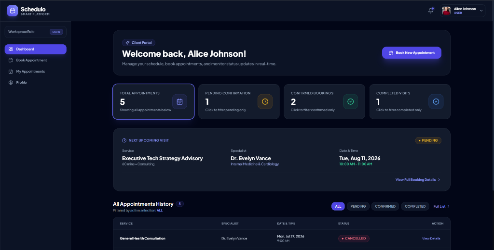
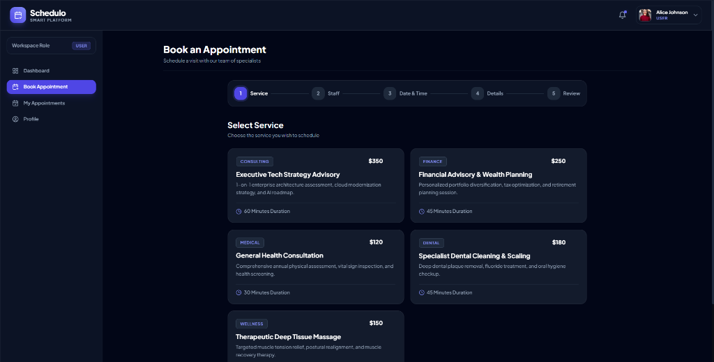
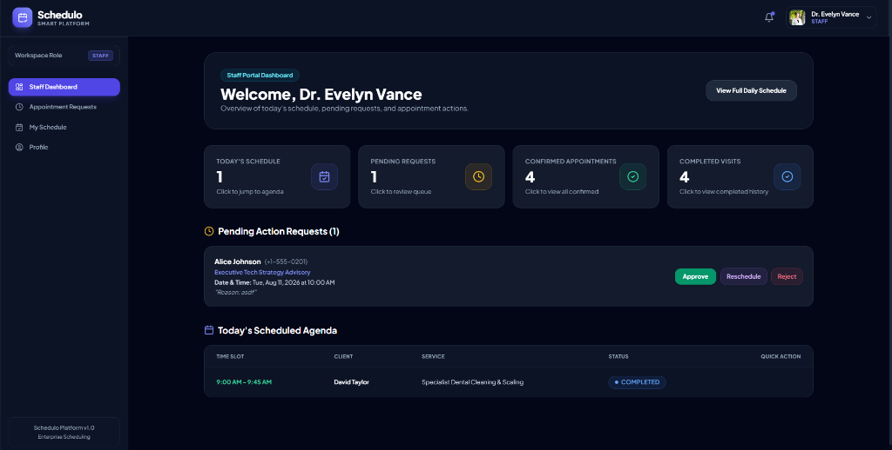
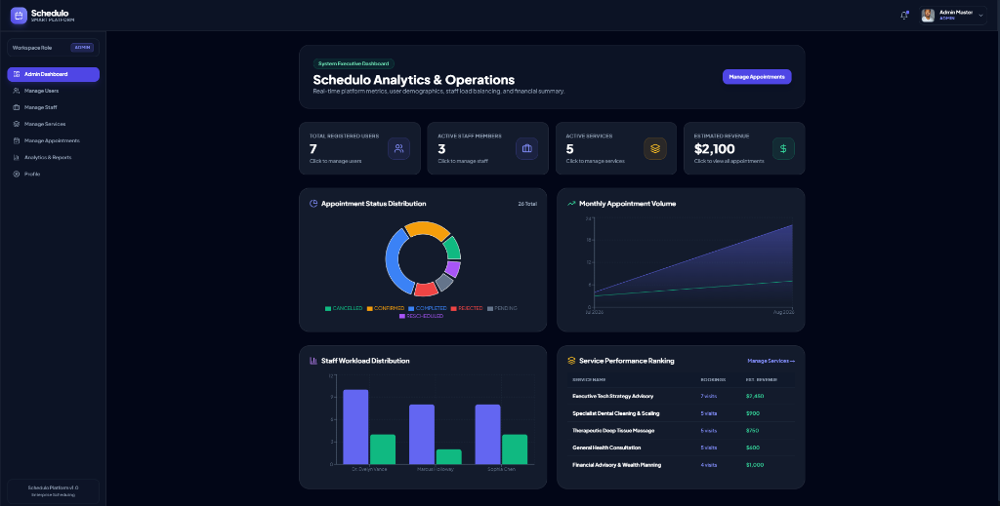

# Schedulo Platform Visual Demonstration

This directory contains real application screenshots showcasing all 10 key interfaces and workflows of the **Schedulo** enterprise platform in exact sequential order.

---

## 📸 Sequential Application Demonstration

### 1. Landing Page

*Modern dark theme landing page featuring hero headline, problem statement, key feature callouts, and direct navigation actions.*

---

### 2. Login & Quick Demo Access

*Authentication portal featuring standard credential login and 1-Click Quick Demo Access buttons for User, Staff, and Admin roles.*

---

### 3. Client Account Registration

*Self-service client account creation form with real-time field validation and password hashing.*

---

### 4. Client User Dashboard

*Client workspace displaying real-time KPI stat cards, next upcoming visit spotlight, and in-place filtered appointment table controls.*

---

### 5. Multi-Step Appointment Booking Wizard

*5-step intuitive booking wizard (Select Service $\rightarrow$ Select Specialist $\rightarrow$ Pick Available Slot $\rightarrow$ Details $\rightarrow$ Review & Submit) with glowing selection ring indicators.*

---

### 6. Staff Portal Dashboard

*Staff specialist workspace displaying pending action request queue (with Approve, Reschedule, Reject controls) and today's scheduled agenda table.*

---

### 7. Specialist Daily Agenda Schedule

*Individual specialist daily agenda view filtering completed and upcoming appointment time slots.*

---

### 8. Service Catalog Management

*Administrative catalog management interface featuring category filtering, active service cards, pricing details, duration tags, and edit/delete controls.*

---

### 9. Specialist Staff Management

*Staff directory management panel displaying specialist department, contact info, shift hours, assigned working days, and modal management controls.*

---

### 10. Executive Admin Dashboard & Analytics

*Real-time executive metrics dashboard displaying overall user count, active staff, total services, estimated revenue, Recharts appointment status pie chart, monthly volume trends, staff workload distribution, and top service performance ranking.*

---

## 📋 Full Sequential Screenshots Checklist

- [x] **01_LandingPage.png**: Landing page hero section
- [x] **02_Login_QuickDemoAccess.png**: Authentication page & Quick Demo Access
- [x] **03_RegisterAccount.png**: Client registration form
- [x] **04_UserDashboard.png**: Client workspace dashboard & in-place filters
- [x] **05_BookAppointment_Wizard.png**: Multi-step booking wizard
- [x] **06_StaffDashboard.png**: Staff portal dashboard & pending queue
- [x] **07_DailySchedule.png**: Staff daily schedule agenda
- [x] **08_ManageServices.png**: Admin service catalog management
- [x] **09_ManageStaff.png**: Specialist staff management
- [x] **10_AdminDashboard_Analytics.png**: Executive dashboard & Recharts analytics
