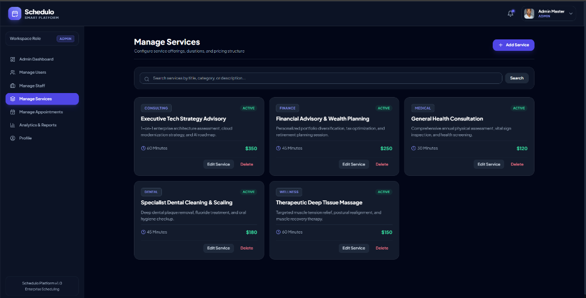
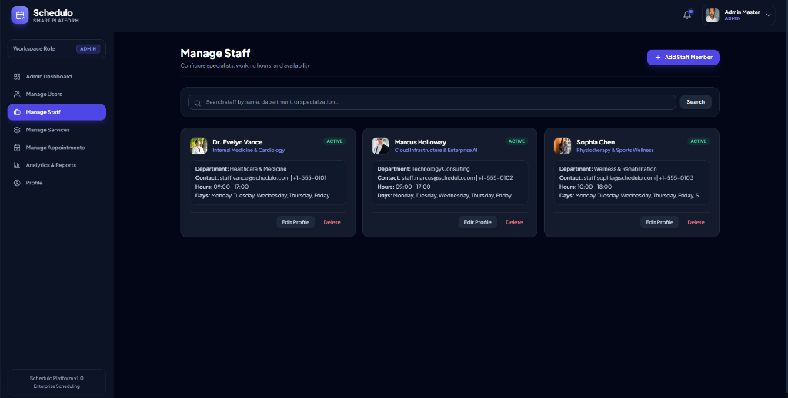
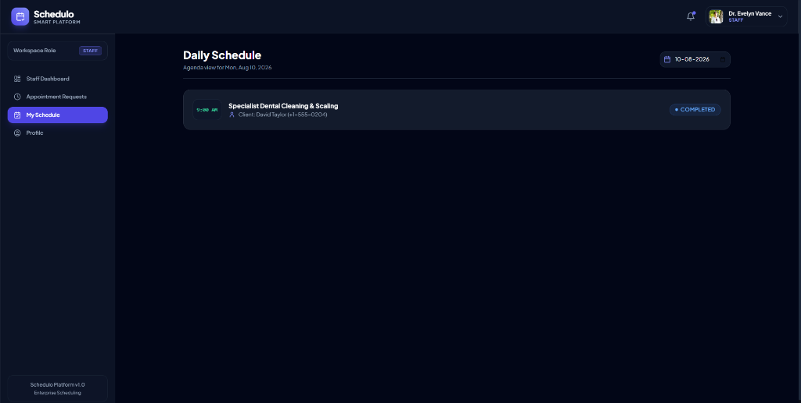

# Schedulo Platform Visual Demonstration

This directory contains real application screenshots showcasing the key interfaces and workflows of the **Schedulo** enterprise platform.

---

## 📸 Captured System Screenshots

### 1. Executive Admin Dashboard & Analytics

*Real-time executive metrics dashboard displaying overall user count, active staff, total services, estimated revenue, Recharts appointment status pie chart, monthly volume trends, staff workload distribution, and top service performance ranking.*

---

### 2. Staff Portal Dashboard

*Staff specialist overview displaying pending action request queue (with Approve, Reschedule, Reject controls) and today's scheduled agenda table.*

---

### 3. Service Catalog Management

*Administrative catalog management interface featuring search, active service cards, pricing details, duration tags, and edit/delete controls.*

---

### 4. Specialist Staff Management

*Staff directory management panel displaying specialist department, contact info, shift hours, assigned working days, and modal management controls.*

---

### 5. Daily Specialist Agenda Schedule

*Individual specialist daily agenda view filtering completed and upcoming appointment time slots.*

---

## 📋 Screenshots Checklist Status

- [x] **01_ManageServices.png**: Admin service catalog management
- [x] **02_ManageStaff.png**: Specialist staff management
- [x] **03_DailySchedule.png**: Staff daily schedule agenda
- [x] **04_AdminDashboard_Analytics.png**: Executive dashboard & Recharts analytics
- [x] **05_StaffDashboard.png**: Staff portal dashboard & pending requests queue
